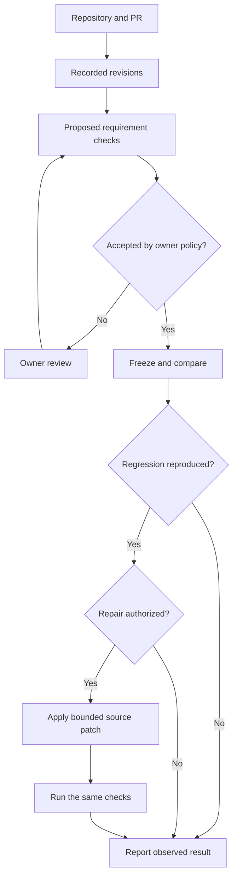

# SippShip 0.3 — implemented product blueprint

## Problem

Reviewers need to know whether a proposed change preserves documented behavior. A fluent model explanation or plausible patch does not supply repeatable evidence. Manual retesting also loses context across revisions.

## Product

A local workspace connects a repository, documented requirements, frozen verification checks and recorded Git revisions. Coding models propose tests and repairs; the workflow controls scope and produces execution evidence.

## Components

- Frontend: browser HTML/CSS/JavaScript served by FastAPI on the same origin.
- Service: Python 3.12, FastAPI, SQLite JSON records, one worker queue.
- Git layer: trusted Git commands, bare clone, immutable blob snapshots, fresh repair worktrees.
- AI layer: IBM Bob MCP or optional OpenAI-compatible/Anthropic API adapters.
- Execution: Python pytest and native Node test profiles. Docker by default; explicitly enabled trusted host mode for rehearsal.
- Integration: GitHub PR REST reads, signed webhook intake and owner-triggered report publication.

## Data and invariants

A Project stores its source, profile, image, document globs, test paths and owner policy. A Review captures that project configuration, base/head/target SHAs, source hashes, proposal, accepted bundle, executions, attempts and events. Jobs and webhook deliveries persist separately.

Accepted check bytes cannot be replaced in the same review. Existing tests come from the base revision and are overlaid in the same relative paths for every execution. Source snapshots and bundle hashes are checked before/after execution. All revisions use the same resolved image/profile. Empty, duplicate, missing, skipped or erroring checks cannot become a successful verdict.

Every repair starts from the original candidate. The owner configures allowed source paths and maximum files, changed lines and attempts. Tests, requirements, configuration and dependencies cannot be repaired away. Exported evidence includes the locally verified SHA; it never represents that patch as already applied to the user's repository.

## Authorization

The operator token controls project configuration, acceptance, repair authorization, automation, export and publication. The agent token supports read/propose/accepted-execution operations. Model APIs never receive operator credentials or GitHub tokens. Runner environments receive no model or GitHub credentials.

Project automation is an owner's prior authorization for bounded steps. The model cannot expand it. Changed protected files and ambiguous requirements stop automatic acceptance/repair. A separate webhook secret authenticates PR events.

## Endpoints

- `GET/POST /v1/projects`, `PUT /v1/projects/{id}/policy`, runner check and accepted bundles.
- `GET/POST /v1/reviews`, per-review context/source/search/proposal/accept/compare.
- Per-review generate/automate/approve-repair/patch/cancel/report/export/publish.
- `GET /v1/jobs/{id}`, `GET /v1/status`.
- `POST /v1/hooks/github`, authenticated `GET /v1/hooks/deliveries`.

Use the local OpenAPI documentation at `/docs` to inspect the schemas. Send the appropriate SippShip role header; the frontend and MCP adapter handle it for normal use.

## Delivery and limits

See `docs/START_HERE.md` for installation, `docs/PRODUCT_GUIDE.md` for operation, and `docs/VALIDATION.md` for tested evidence. This release supports a controlled single-owner workflow; it is not presented as universal, maintainer-free production infrastructure.
